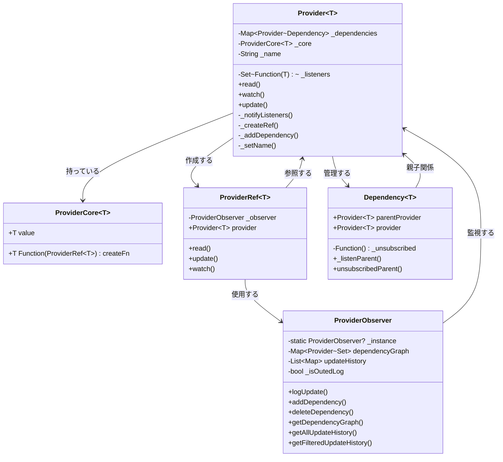

# fiperes

状態管理と依存関係追跡機能を持つ、モダンなFlutterパッケージです。React Hooksのような使いやすいAPIを提供しながら、強力なデバッグ機能も備えています。

## 主な特徴

- シンプルで直感的なAPI設計
- 自動的な依存関係管理
- 包括的なデバッグ機能
- 型安全性による堅牢な実装

## インストール方法

```yaml
dependencies:
  fiperes: ^0.0.1
```

## 基本的な使用例

```dart
// プロバイダーを作成
final counterProvider = Provider<int>.createProvider(
  (ref) => 0,
  name: 'counter',
);

// 状態の読み取りと更新
void main() {
  // 状態の取得
  int currentCount = counterProvider.read();
  
  // 状態の更新
  counterProvider.update((current) => current + 1);
  
  // 状態の監視
  final unsubscribe = counterProvider.watch((newCount) {
    print('カウンターが更新されました: $newCount');
  });
}
```

## アーキテクチャ概要



## クラス構造の説明

上記の図は、fiperesの主要なコンポーネントとその関係を示しています：

- `Provider`: メインとなるクラスで、状態管理と依存関係の追跡を行います
- `ProviderCore`: 実際の値と作成関数を保持します
- `ProviderRef`: プロバイダーへの参照を提供し、状態の読み取り・更新を行います
- `Dependency`: プロバイダー間の依存関係を管理します
- `ProviderObserver`: デバッグ機能を提供し、すべてのプロバイダーの動作を監視します

## 高度な機能

### 依存関係の管理

```dart
// 複数のプロバイダー間の依存関係
final userProvider = Provider<User>.createProvider(
  (ref) => User(id: 1),
  name: 'user',
);

final profileProvider = Provider<Profile>.createProvider(
  (ref) {
    final user = ref.watch(userProvider);
    return Profile(userId: user.id);
  },
  name: 'profile',
);
```

### デバッグ機能

```dart
// 更新履歴の確認
final history = ProviderObserver.getAllUpdateHistory(counterProvider);
print(history); // 各更新時の値を表示

// 依存関係グラフの取得
final graph = ProviderObserver.getDependencyGraph();
print(graph); // プロバイダーの依存関係を表示
```

## ベストプラクティス

1. プロバイダーの命名規則
  - 単数形を使用（例：`userProvider`、`productProvider`）
  - 論理的なグループ名を付与（例：`auth.userProvider`）


2. 依存関係の管理
  - 不要な依存関係は避ける
  - `unsubscribe` を適切に呼び出し、メモリリークを防ぐ


3. エラーハンドリング
```dart
try {
  provider.update((state) => newState);
} catch (e) {
  ProviderObserver.log('エラーが発生しました: $e');
}
```


## トラブルシューティング

1. 依存関係の循環参照が検出された場合
  - プロバイダーの依存関係を再設計する
  - 中間層のプロバイダーを追加することを検討する


2. メモリリークが疑われる場合
  - `unsubscribe` の呼び出しを確認する
  - `ProviderObserver.getDependencyGraph()` で依存関係を確認する


## 開発者向け情報
- バグ報告: [GitHub Issues](https://github.com/Rerurate514/fiperes/issues)
